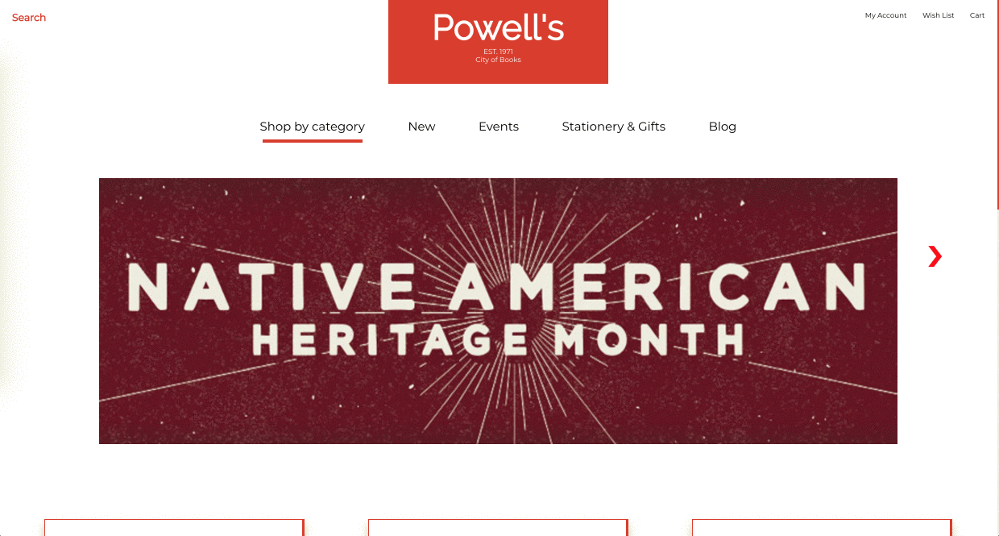

# Powell's Books

Powell's Books reimagined landing page built as a single-page application.  This concept was designed and established initially as a wireframe using Sketch.  That was then used as a starting point and guideline to drive the development process. 

## Getting Started

This project is best viewed using the following method: open your favorite terminal application, change the directory to where the local application resides using `cd path/to/app`.  After-which, run `http-server -o`.

## Built With

* HTML
* CSS/CSS3
* Javascript

## Demo

